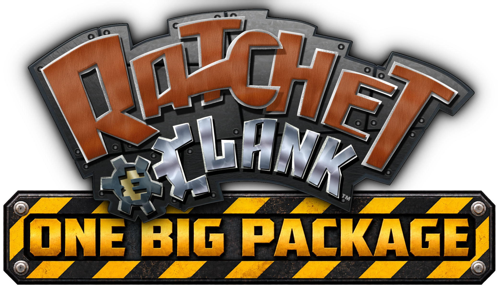

<p align="center">
  
</p>

# Ratchet & Clank: One Big Package

**One Big Package (OBP)** is a Godot 4 + C# reconstruction project for the original PS2 **Ratchet & Clank**, **Going Commando**, and **Up Your Arsenal**, with the long-term goal of combining their recovered systems and content into one game.

Retail game data stays outside the repository and is supplied locally by the user. Recovered native behaviour and OBP-created design choices are kept explicitly separate.

## Start here

On Windows:

```powershell
./tools/bootstrap-dev.ps1
./tools/test.ps1 -Configuration Release
./tools/play.ps1
```

`main` is the normal working branch. Work directly on it when nothing else can collide; concurrent workers use temporary isolated branches/worktrees and integrate the actual result back into `main`.

There is no separate browser or TypeScript implementation to maintain.

## Architecture
```text
user-supplied retail ISO / files
        |
        v
OBP.IO          bounded native random access, splits, hashing
        |
        v
OBP.PS2         ISO-9660, SYSTEM.CNF, ELF32, shared PS2 codecs
        |
        v
OBP.RAC1/2/3    game-specific formats, evidence and native behaviour
        |
        v
OBP.Runtime     engine-independent runtime concepts
        |
        v
OBP.Godot       thin Godot adapter
        |
        v
game/           application, input, UI, cameras and presentation
```

Godot hosts OBP but does not define native Ratchet formats or gameplay rules. Shared abstractions belong in `OBP.Runtime` only when source evidence justifies them.

## Current baseline
The native runtime can load all three supported trilogy authorities through one neutral destination/provider path, reconstruct worlds into `RuntimeWorld`, build them in Godot, and repeatedly load/unload them. R&C1 currently has the deepest active gameplay work, including native player movement, live entity state, crates/pickups, Nanotech/death state, weapon inventory, Bomb Glove and wrench-combat slices, campaign state, and representative hostile behaviour.

Useful project orientation:

- [`docs/CURRENT_STATE.md`](docs/CURRENT_STATE.md) — current implementation snapshot.
- [`docs/ARCHITECTURE.md`](docs/ARCHITECTURE.md) — runtime/import boundaries and evidence rules.
- [`docs/PROJECT_VISION.md`](docs/PROJECT_VISION.md) — creative direction and deliberately unresolved design choices.
- [`research/README.md`](research/README.md) — retail archaeology and generated evidence index.
- [`AGENTS.md`](AGENTS.md) — the short rules for autonomous/local development.

## Validation

Portable CI is C# only and runs on pushes to `main`, plus pull requests. Local retail-backed validation is explicit:

```powershell
./tools/test-retail.ps1
```

Run `dotnet format OneBigPackage.sln --verify-no-changes --no-restore` before integrating code changes.

## Source and copyright boundary

OBP does **not** contain Sony/Insomniac retail assets, executables, disc images, audio, or captures. Source bytes remain local; Git contains code, tests, documentation, non-infringing metadata and rebuildable payload-free evidence.
